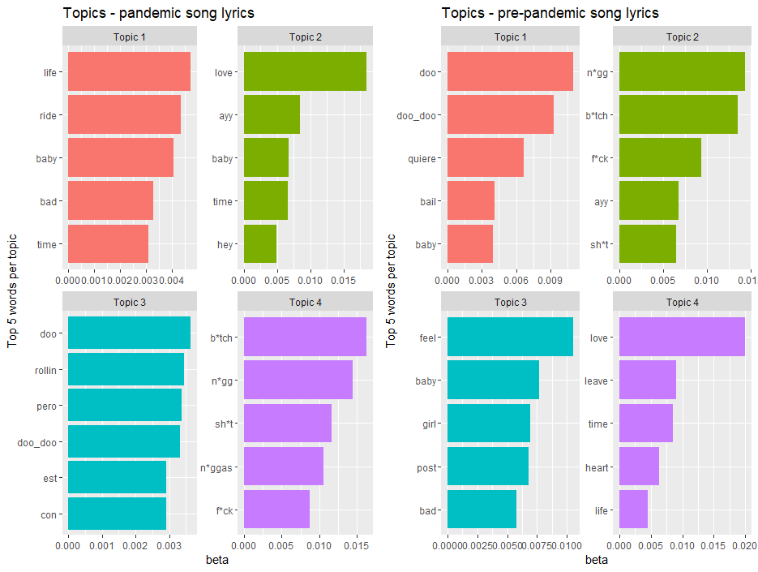
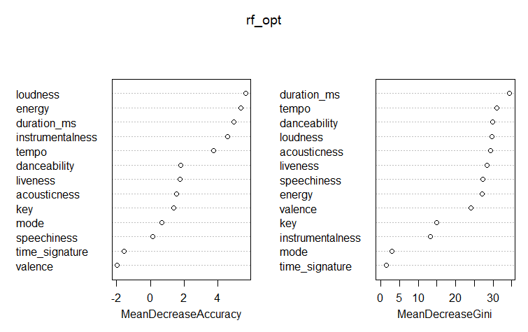
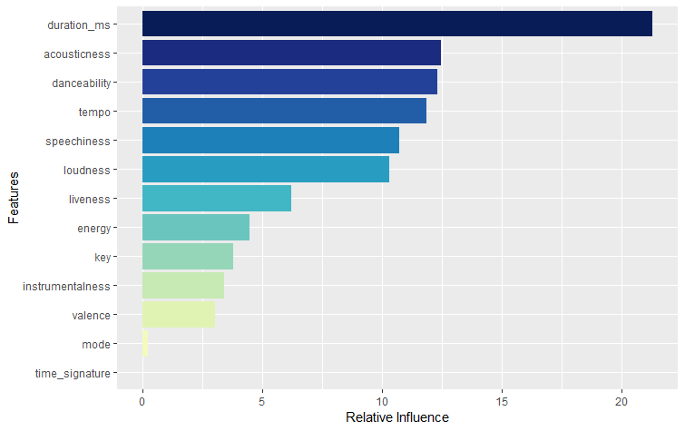

## [Investigating the impact of the pandemic on music consumption]
- Used topic modelling and LDA on lyrics from songs before and after the pandemic.
- Compared logistic regression, boosted trees and random forest classifiers to distinguish between songs before and after the pandemic based on their audio features.
- Used Spotify API to retrieve audio features and Genius API to scrape lyrics.
- R libraries used: ggplot2, tidymodels, tm, topicmodels, caret, gbm, tree, randomForest.
- _Will upload the code and report soon hopefully..._

I'll just put here some plots coming from the report, done using ggplot2.

This first plot illustrates the results of a Latent Dirichlet Allocation ([LDA](https://en.wikipedia.org/wiki/Latent_Dirichlet_allocation)) topic modelling analysis with k = 4. 
This was the value which maximized the coherence score (0.32) within a grid search going from k = 1 to k = 20.
In particular, two models are applied separately on the pandemic and the pre-pandemic lyrics, extracting four topics each. 

The following two plots represent the feature importance plots of the [audio features](https://developer.spotify.com/documentation/web-api/reference/get-audio-features)
extracted from the Spotify API, respectively for the Random Forest classifier and the Boosting model.

The plot on the left represents the average decrease in the accuracy of predictions in the OOB sample
when a certain variable is excluded from the model, while that on the right represents the average
decrease of the Gini index, a measure of node purity resulting from splits over each variable. 

The following plot shows the relative influence of the variables employed in the boosted trees model over the whole dataset,
optimizing through cross-validation the number of used trees.

[back](./portfolio.md)