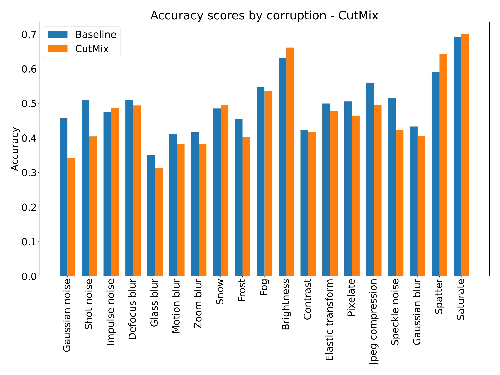

## [Comparing state-of-the-art data augmentation methods on varying dataset settings](https://github.com/alescortes/machine-learning-ii)
- Group project for the Machine Learning II course @ University of Twente, the Netherlands.
- A study of how the performance of a CNN classifier changes when applying AugMix, CutMix, MixUp and GridMask on several downsampled versions of CIFAR-10.
- Checking if the methods increase robustness to common image corruptions using CIFAR-10-C as an OOD evaluation.
- Python libraries used: Tensorflow, Keras, scikit-learn.
- _Code will be uploaded soon..._

Project report can be found [here](https://raw.githubusercontent.com/alescortes/machine-learning-ii/main/ML2_Project_Paper-1.pdf). 

The following image represents the project workflow: each configuration of downsampled subsets considered is augmented 
with augmentation techniques and augmentation factors, then evaluated in and out of distribution.

Here is shown a comparison of test accuracy values for each configuration and each augmentation technique,
reaching the original dataset size. The black dotted line represents the test accuracy for the original
dataset.

Finally we report the test accuracy scores by corruption on CIFAR-10-C of Configuration 4 without augmentation
and with every technique using an augmentation factor of 200%. 

|                                            |                                              |
|:------------------------------------------:|:--------------------------------------------:|
|  |  |
|  |     |

[back](./portfolio.md)