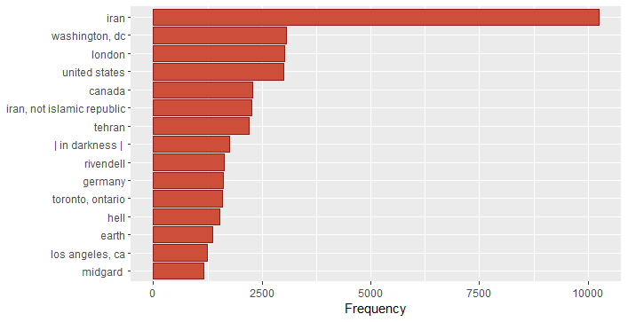
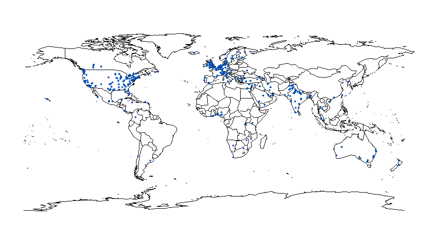
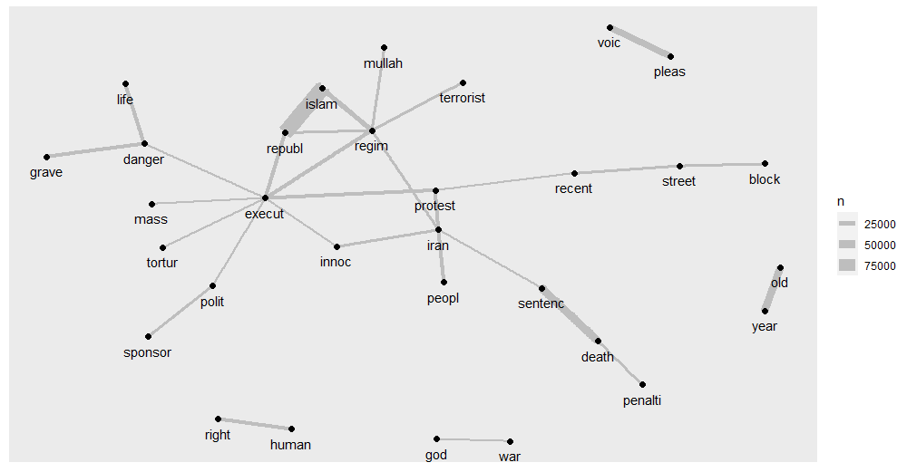
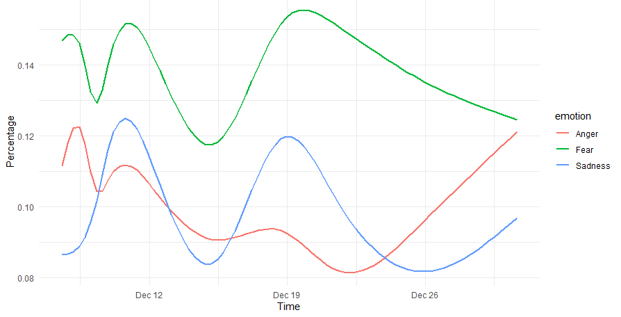
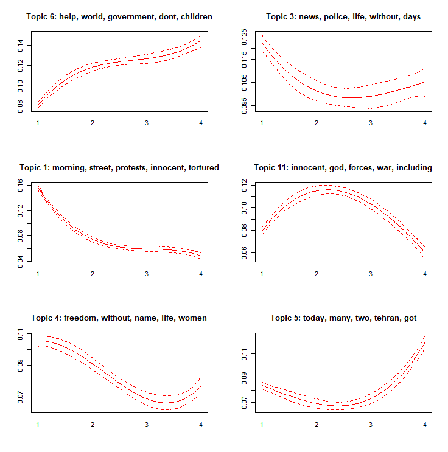

## [Computational analysis of Twitter discourse surrounding the protests in Iran](https://github.com/alescortes/digital-social-data)
- Project for the Digital Social Data course at the University of Trento.
- Collected and cleaned 500K Tweets over the span of three weeks using _rtweet_.
- Employed text mining, topic modelling and sentiment analysis techniques to gather insight on the protest movement
- R libraries used: ggplot2, janitor, dplyr, tm, quanteda, topicmodels, syuzhet, stm
- _Will upload the code soon hopefully..._

Take a look at the report [here](https://raw.githubusercontent.com/alescortes/digital-social-data/main/Cortese_Digital_Social_Data_Report.pdf).

Some visualizations of the analysis:

Top 15 self-reported user locations:   
 

Map of the actual geolocated tweets:

A simple word network which can be useful to see the most common word bigrams in the whole corpus:

Sentiment analysis showing the prevalence of anger, fear and sadness over the analyzed time span:

Employing [Structural Topic Model](https://www.structuraltopicmodel.com/) (STM) to show how the topics of the Twitter 
discourse surrounding the protests evolve over time:

[back](./portfolio.md)