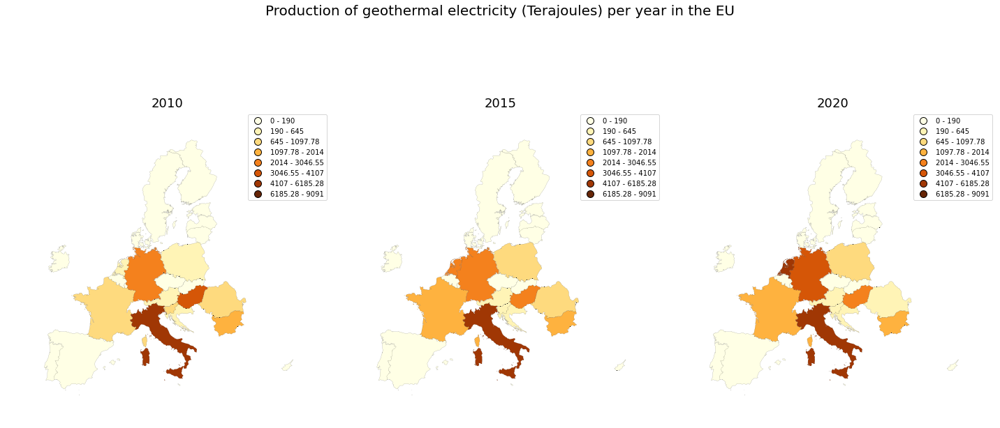
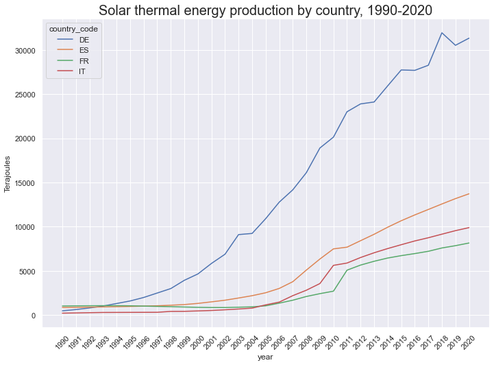

## [Exploratory Data Analysis and Visualization of Renewable Energy Consumption in the EU](https://github.com/alescortes/european-energy-consumption)
- Analysis of a Eurostat dataset about renewable energies in the EU. 
- Created different types of visualizations (choropleth maps, bar charts, waffle charts, lineplots, ...) to gather insight from the data.
- Python libraries used: pandas, geopandas, matplotlib, seaborn

[back](./portfolio.md)
