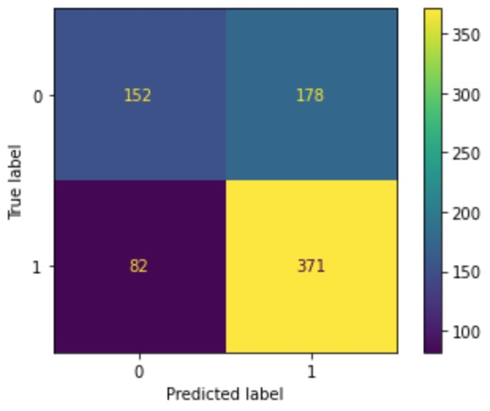
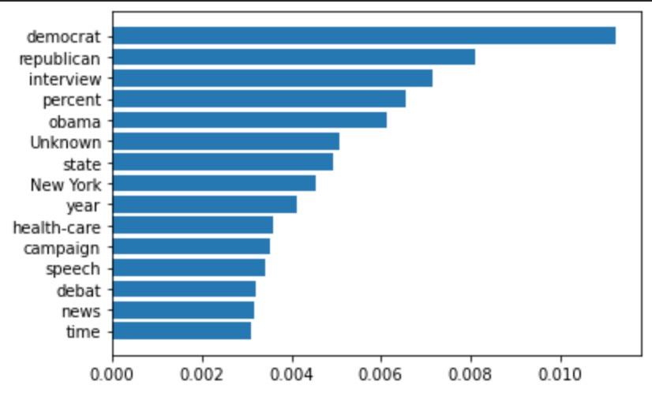

## [Fake news classifier using Natural Language Processing](https://github.com/alescortes/fake-news-classifier)
- Group project for the Natural Language Processing course at the University of Twente, the Netherlands.
- Used SVM and Random Forest to classify political statements from the LIAR dataset (n = 12792) as fake news or not.
- Compared different models (bag-of-words with tf-idf, word2vec, doc2vec) to create embeddings from text.
- Performed hyperparameter tuning and feature importance.
- Repeated the analyses adding metadata (context, party affiliation of the speaker, state)
- Employed error analysis to get insight behind the predictions.
- Python libraries used: pandas, scikit-learn, NLTK, gensim.

[Here](https://raw.githubusercontent.com/alescortes/fake-news-classifier/main/NLP_Project_Group16.pdf) is the project report
and [here](https://raw.githubusercontent.com/alescortes/fake-news-classifier/main/NLP_Poster_Group16.pdf) is the project poster (we had a lot of fun doing our poster presentation!). 

The images refer to the Random Forest model with mixed unigram and bigram tf-idf embeddings, plus metadata.

|             Confusion matrix              |  Feature importance|
|:-----------------------------------------:|:-------------------------:|
|  | |

[back](./portfolio.md)